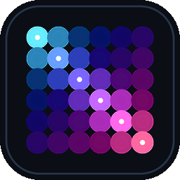

# Lumen Gallery

A small Windows desktop app to browse the art in [`../../art/`](../../art) and
send any piece straight to the LED wall.



- **Live grid** of every still (`.png`) and loop (`.gif`) in `art/`, newest
  first — new daily pieces appear on relaunch. Reads the folder directly.
- **On the wall now** — mirrors the panel's current canvas, updated live.
- **Click** a piece to select, **Send to Wall** (or double-click) pushes it:
  stills via `POST /image`, GIF loops via `POST /gif`.
- **Play a show** — start the self-playing games (Pac-Man / Snake / Galaga)
  or Conway's Life on the wall; **Stop show** halts it and returns the wall to
  the Day Labs logo default.
- Connection status, brightness slider, screen on/off — all talk to the
  Lumen daemon at `http://127.0.0.1:7788`.

The Day Labs mark (`art/daylabs-mark-32.png`) is the daemon's default boot
image — what the panel shows on power-up until a scene, game, or send replaces
it.

Pure Python stdlib + Tkinter + Pillow (in the repo's `.venv`); ships as a
standalone Windows `.exe` via PyInstaller.

## Build (produces the .exe)

```powershell
powershell -File app\gallery\build.ps1
```

Installs PyInstaller if needed and builds `dist\Lumen Gallery.exe` (one file,
windowed, icon embedded). Re-run after changing the source. The exe reads the
live `art/` folder — it is not bundled — so new daily pieces still appear.

## Desktop shortcut

```powershell
powershell -File app\gallery\install-shortcut.ps1
```

Creates **Lumen Gallery** on the Desktop pointing at the built exe (falls back
to a windowless `pythonw` launch if the exe isn't built yet). Re-run
`make_icon.py` to regenerate `icon.ico`.

## Run without building

```powershell
.venv\Scripts\pythonw.exe app\gallery\lumen_gallery.pyw
```

The daemon must be running (it auto-starts at logon; otherwise
`powershell .\start-lumen.ps1`).
